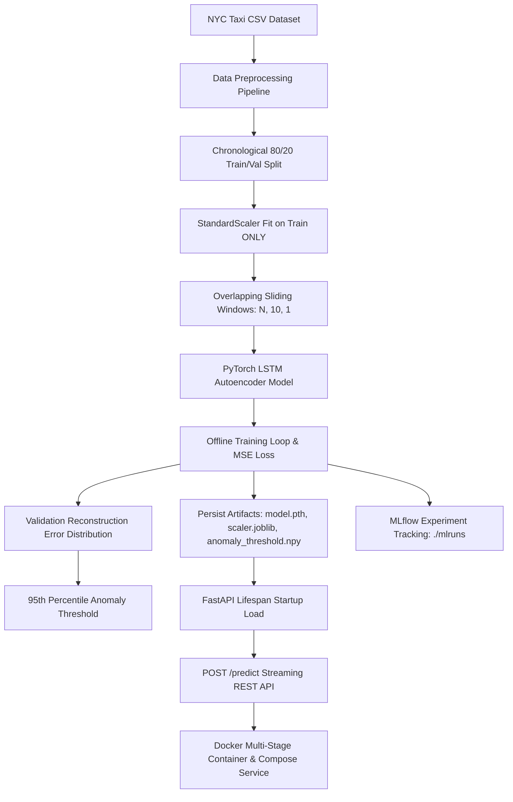

# Time-Series Anomaly Detection System

A production-grade, end-to-end Machine Learning / MLOps system for real-time time-series anomaly detection using PyTorch, Scikit-Learn, MLflow, FastAPI, Docker, and Docker Compose.

---

## Table of Contents
1. [Project Overview](#1-project-overview)
2. [Problem Statement](#2-problem-statement)
3. [Business Use Cases](#3-business-use-cases)
4. [Architecture](#4-architecture)
5. [Mathematical Intuition](#5-mathematical-intuition)
6. [LSTM Autoencoder](#6-lstm-autoencoder)
7. [Reconstruction Error](#7-reconstruction-error)
8. [Threshold Strategy](#8-threshold-strategy)
9. [Data Pipeline](#9-data-pipeline)
10. [Training Pipeline](#10-training-pipeline)
11. [MLflow Experiment Tracking](#11-mlflow-experiment-tracking)
12. [FastAPI Inference Service](#12-fastapi-inference-service)
13. [Docker & Docker Compose](#13-docker--docker-compose)
14. [Project Structure](#14-project-structure)
15. [Installation](#15-installation)
16. [.venv Setup](#16-venv-setup)
17. [Training](#17-training)
18. [Running the API](#18-running-the-api)
19. [API Usage Examples](#19-api-usage-examples)
20. [Testing](#20-testing)
21. [MLflow UI Inspection](#21-mlflow-ui-inspection)
22. [Results](#22-results)
23. [Troubleshooting](#23-troubleshooting)
24. [Future Improvements](#24-future-improvements)

---

## 1. Project Overview
This repository implements a production-quality time-series anomaly detection pipeline designed to detect unusual patterns, spikes, and structural disruptions in temporal streams (e.g. passenger demand, CPU usage, network traffic). The core model is an **LSTM Autoencoder** implemented in **PyTorch 2.5.1+cpu**, trained offline using non-overlapping/overlapping window representations, logged with **MLflow**, and deployed via **FastAPI** inside a **Multi-Stage Docker** container managed by **Docker Compose**.

---

## 2. Problem Statement
Traditional rule-based thresholding struggles with complex time-series patterns containing temporal dependencies, daily periodicity, and seasonal trends. Unsupervised deep learning via autoencoders overcomes this by learning to reconstruct normal temporal patterns. When an anomalous sequence is encountered, the model fails to reconstruct it accurately, producing a high **Reconstruction Error (MSE)** that exceeds a mathematically derived percentile threshold.

---

## 3. Business Use Cases
- **Smart Infrastructure & Transportation**: Real-time traffic congestion spikes, unusual taxi demand surges, or transit bottlenecks (e.g., NYC Taxi dataset).
- **IT Operations & DevOps (AIOps)**: Early warning system for unexpected CPU utilization spikes, memory leaks, or API latency anomalies.
- **Financial & E-Commerce Security**: Fraudulent transaction velocity detection, credit card usage anomalies, and sudden order volume drops.
- **Industrial IoT & Telemetry**: Predictive maintenance for manufacturing machinery sensors (temperature, vibration, pressure anomalies).

---

## 4. Architecture



---

## 5. Mathematical Intuition

### Time-Series Window Representation
Given a univariate time-series sequence $X = [x_1, x_2, \dots, x_T]^T$, we construct sliding context windows $W_i$ of length $L$:
$$W_i = \begin{bmatrix} x_i & x_{i+1} & \dots & x_{i+L-1} \end{bmatrix}^T \in \mathbb{R}^{L \times 1}$$

### Z-Score Normalization (Zero Data Leakage)
Normalization parameters are computed strictly from the training split:
$$\mu_{\text{train}} = \frac{1}{N_{\text{train}}} \sum_{t=1}^{N_{\text{train}}} x_t, \quad \sigma_{\text{train}} = \sqrt{\frac{1}{N_{\text{train}}} \sum_{t=1}^{N_{\text{train}}} (x_t - \mu_{\text{train}})^2}$$
$$z_t = \frac{x_t - \mu_{\text{train}}}{\sigma_{\text{train}}}$$

### Reconstruction Error (Mean Squared Error)
For an input window $W_i$ and model reconstruction $\hat{W}_i = \text{Autoencoder}(W_i)$, the sequence reconstruction error is:
$$\mathcal{L}_{\text{MSE}}(W_i, \hat{W}_i) = \frac{1}{L} \sum_{t=1}^{L} (W_{i,t} - \hat{W}_{i,t})^2$$

### Anomaly Decision Rule
Using the 95th percentile threshold $\tau = P_{95}(\{\mathcal{L}_{\text{MSE}}(W_v, \hat{W}_v) \mid W_v \in \mathcal{D}_{\text{val}}\})$:
$$\text{is\_anomaly}(W_{\text{new}}) = \begin{cases} 1 & \text{if } \mathcal{L}_{\text{MSE}}(W_{\text{new}}, \hat{W}_{\text{new}}) > \tau \\ 0 & \text{otherwise} \end{cases}$$

---

## 6. LSTM Autoencoder Architecture
The PyTorch `LSTMAutoencoder` (`src/models/anomaly_model.py`) adheres strictly to the assignment's contract:
1. **Encoder (`nn.LSTM`)**: Maps input 3D tensor $(B, L, 1)$ into a latent hidden state vector $h_L \in \mathbb{R}^{B \times H}$.
2. **Latent Bottleneck Extraction**: Extracts final layer hidden state $z = h_L[-1]$.
3. **Sequence Expansion (`.repeat()`)**: Un-squeezes and repeats the latent representation across sequence dimension $L$: $Z = z.\text{unsqueeze}(1).\text{repeat}(1, L, 1) \in \mathbb{R}^{B \times L \times H}$.
4. **Decoder (`nn.LSTM`)**: Decodes the repeated sequence back to hidden representations.
5. **Linear Projection (`nn.Linear`)**: Projects hidden features back to input feature dimension $(B, L, 1)$.

---

## 7. Reconstruction Error
Reconstruction error measures how closely the autoencoder reproduces its input. Since the autoencoder is trained exclusively on normal patterns, normal sequences yield low reconstruction errors ($\approx 0.001 - 0.008$). Anomalous sequences containing sudden structural changes yield high reconstruction errors ($> 0.017$), causing them to trigger anomaly alerts.

---

## 8. Threshold Strategy
- **Non-Parametric Percentile Thresholding**: Configured via `config.yaml` (`anomaly.threshold_percentile: 95.0`).
- **Zero Data Leakage**: Evaluated on validation set sequences post-training.
- **Persistence**: Saved as scalar NumPy artifact `anomaly_threshold.npy` and logged to MLflow.

---

## 9. Data Pipeline
Implemented in `src/data/preprocess.py`:
- Dataset: NYC Taxi Passenger Counts (`data/raw/nyc_taxi.csv`, 10,320 rows at 30-minute intervals).
- Chronological Split: 80% Training (8,256 rows), 20% Validation (2,064 rows).
- Scaler fitting: `StandardScaler` fitted **only** on training data split.
- Windowing: `create_sequences(data, window_size=10)` generates overlapping 3D NumPy arrays:
  - Training sequences: `(8247, 10, 1)`
  - Validation sequences: `(2055, 10, 1)`

---

## 10. Training Pipeline
Implemented in `train.py`:
- Reads hyperparameters dynamically from `config.yaml`.
- Uses PyTorch `DataLoader` with Adam optimizer (`lr=0.001`) and `MSELoss`.
- Runs 20 training epochs.
- Tracks `best_val_loss` and saves **only** the lowest validation loss state dict to `model.pth`.
- Calculates per-sequence validation errors, computes 95th percentile threshold, and persists `model.pth`, `scaler.joblib`, and `anomaly_threshold.npy`.

---

## 11. MLflow Experiment Tracking
Integrated into `train.py`:
- Local file-based backend: `./mlruns`
- Experiment Name: `time-series-anomaly-detection`
- Logged Parameters: `data.*`, `model.*`, `training.*`, `anomaly.*`
- Logged Metrics: Per-epoch `train_loss` & `val_loss` (steps 1–20), `best_val_loss`, `best_epoch`, `anomaly_threshold`.
- Registered Artifacts: `model.pth`, `scaler.joblib`, `anomaly_threshold.npy`.

---

## 12. FastAPI Inference Service
Implemented in `src/api/main.py`:
- **Lifespan Startup**: Loads `model.pth`, `scaler.joblib`, and `anomaly_threshold.npy` **once** into `app.state`.
- **Zero File I/O in `/predict`**: Fast in-memory inference handler.
- **`GET /health`**: Returns HTTP 200 with `{"status": "ok"}`.
- **`POST /predict`**: Accepts JSON `{"data_point": [float, ...]}`.
  - Length Validation: Returns HTTP 400 Bad Request if length $\neq$ `window_size` (10).
  - Pydantic Validation: Returns HTTP 422 for missing or invalid types.
  - Scaling: Applies `scaler.transform()` (no `fit`).
  - PyTorch forward pass: Executes with `torch.no_grad()` in `model.eval()`.
  - Response contract: Returns `input_data`, `anomaly_score`, `is_anomaly` (0 or 1), and `threshold`.

---

## 13. Docker & Docker Compose
- **Multi-Stage `Dockerfile`**:
  - `builder` stage (`python:3.11-slim`): Creates `/opt/venv`, installs dependencies from `requirements.txt` with PyTorch CPU wheel index.
  - `runner` stage (`python:3.11-slim`): Copies `/opt/venv`, application source (`src/`), test suite (`tests/`), `config.yaml`, and trained artifacts. Exposes port `8000`.
- **`docker-compose.yml`**:
  - Service named `anomaly_api`.
  - Maps host port `8000:8000`.
  - Supports evaluator test command: `docker compose exec anomaly_api pytest tests/ -v`.

---

## 14. Project Structure
```
time-series-anomaly-detection/
├── .env                        # Local environment variables
├── .env.example                # Template environment file
├── .gitignore                  # Git ignore rules
├── Dockerfile                  # Production multi-stage Dockerfile
├── LICENSE                     # MIT License
├── README.md                   # Complete system documentation
├── config.yaml                 # Centralized project configuration
├── docker-compose.yml          # Docker Compose service specification
├── pyrightconfig.json          # VS Code / Pyright workspace configuration
├── requirements.txt            # Pinned project dependencies
├── train.py                    # Offline training & MLflow tracking script
├── model.pth                   # Trained PyTorch model state dict
├── scaler.joblib               # Fitted StandardScaler object
├── anomaly_threshold.npy       # Calculated 95th percentile threshold
├── artifacts/                  # Persistent model artifact directory
├── data/
│   ├── raw/
│   │   └── nyc_taxi.csv        # NYC Taxi passenger count dataset
│   └── processed/              # Processed data output directory
├── mlruns/                     # Local MLflow experiment tracking runs
├── src/
│   ├── __init__.py
│   ├── api/
│   │   ├── __init__.py
│   │   └── main.py             # FastAPI REST service implementation
│   ├── data/
│   │   ├── __init__.py
│   │   └── preprocess.py       # Data preprocessing pipeline
│   └── models/
│       ├── __init__.py
│       └── anomaly_model.py    # LSTM Autoencoder PyTorch model
└── tests/
    ├── test_api.py             # FastAPI REST endpoint & response contract tests
    ├── test_artifacts.py       # Artifact persistence & threshold tests
    ├── test_data.py            # Data pipeline & leakage unit tests
    ├── test_mlflow.py           # MLflow tracking unit tests
    └── test_models.py          # PyTorch model architecture unit tests
```

---

## 15. Installation

### Prerequisites
- Python `3.11.9`
- Docker Desktop (v24+) & Docker Compose (v2+)
- Git

---

## 16. .venv Setup

```bash
# 1. Clone repository
git clone https://github.com/rakeshchinni77/time-series-anomaly-detection.git
cd time-series-anomaly-detection

# 2. Create Python 3.11 virtual environment
python -m venv .venv

# 3. Activate virtual environment
# Windows PowerShell:
.venv\Scripts\Activate.ps1
# Linux/macOS:
source .venv/bin/activate

# 4. Install pinned dependencies
pip install --upgrade pip
pip install -r requirements.txt
```

---

## 17. Training

To train the LSTM Autoencoder model, compute the anomaly threshold, log parameters to MLflow, and persist artifacts:

```bash
python train.py
```

### Output Summary Example:
```
Starting training on device: cpu
Hyperparameters: epochs=20, batch_size=64, lr=0.001, window_size=10
Epoch [20/20] - Train Loss: 0.006939 | Val Loss: 0.006928

Training complete.
Best Validation Loss: 0.006928 (Epoch 20)

MLflow Experiment Tracking & Artifact Summary:
  Experiment Name: time-series-anomaly-detection
  Threshold Percentile: 95.0%
  Calculated Anomaly Threshold: 0.016799
  Model Artifact: model.pth
  Scaler Artifact: scaler.joblib
  Threshold Artifact: anomaly_threshold.npy
```

---

## 18. Running the API

### Option A: Local Uvicorn Development Server
```bash
uvicorn src.api.main:app --host 127.0.0.1 --port 8000 --reload
```

### Option B: Production Docker Compose
```bash
docker compose up -d --build
```

---

## 19. API Usage Examples

### 1. Health Check (`GET /health`)
```bash
curl -X GET http://127.0.0.1:8000/health
```
**Response (HTTP 200 OK):**
```json
{
  "status": "ok"
}
```

### 2. Normal Prediction Request (`POST /predict`)
```bash
curl -X POST http://127.0.0.1:8000/predict \
  -H "Content-Type: application/json" \
  -d '{"data_point": [10.0, 15.2, 14.1, 13.8, 16.0, 15.5, 14.9, 13.2, 15.0, 14.4]}'
```
**PowerShell Equivalent:**
```powershell
$body = @{ data_point = @(10.0, 15.2, 14.1, 13.8, 16.0, 15.5, 14.9, 13.2, 15.0, 14.4) } | ConvertTo-Json
Invoke-RestMethod -Uri http://127.0.0.1:8000/predict -Method Post -ContentType "application/json" -Body $body
```
**Response (HTTP 200 OK):**
```json
{
  "input_data": [10.0, 15.2, 14.1, 13.8, 16.0, 15.5, 14.9, 13.2, 15.0, 14.4],
  "anomaly_score": 0.004321,
  "is_anomaly": 0,
  "threshold": 0.016799
}
```

### 3. Invalid Sequence Length Request (`POST /predict`)
```bash
curl -X POST http://127.0.0.1:8000/predict \
  -H "Content-Type: application/json" \
  -d '{"data_point": [10.0, 15.2, 14.1]}'
```
**Response (HTTP 400 Bad Request):**
```json
{
  "detail": "Invalid data_point length. Expected exactly 10 float values, got 3."
}
```

---

## 20. Testing

### Run Complete Local Test Suite (49 Tests)
```bash
pytest tests/ -v
```

### Run Evaluator Test Suite Inside Docker Container
```bash
docker compose exec anomaly_api pytest tests/ -v
```

### Test Breakdown (49 Passed):
- `tests/test_data.py`: 16 passed (Data preprocessing, scaler isolation, sequence shapes, chronological ordering)
- `tests/test_models.py`: 18 passed (LSTM Autoencoder inheritance, batch dimensions, dynamic lengths, autograd flow)
- `tests/test_artifacts.py`: 4 passed (Threshold percentile formula, artifact reloading, non-negativity)
- `tests/test_mlflow.py`: 2 passed (Flatten config, isolated MLflow parameter & metric tracking)
- `tests/test_api.py`: 9 passed (FastAPI health check, predict contract, HTTP 400 length validation, HTTP 422 Pydantic type validation, zero file I/O regression test)

---

## 21. MLflow UI Inspection
To view the experiment tracking dashboard locally:

```bash
mlflow ui --backend-store-uri ./mlruns
```
Navigate to `http://127.0.0.1:5000` in your browser to inspect runs, logged hyperparameters, loss curves, and persisted model artifacts.

---

## 22. Results

| Metric / Evaluation Gate | Result | Status |
| :--- | :--- | :--- |
| **Best Validation Loss** | `0.006928` (Epoch 20) | PASS |
| **Calculated Anomaly Threshold** | `0.016799` (95th Percentile) | PASS |
| **Validation Sequence Count** | `2,055` sequences | PASS |
| **Automated Test Pass Rate** | **49 / 49 PASSED** | PASS |
| **FastAPI Zero File I/O** | Verified via Mock Regression Tests | PASS |
| **Docker Compose Evaluator Command** | `docker compose exec anomaly_api pytest` PASSED | PASS |

---

## 23. Troubleshooting

- **Issue: `HTTP 400 Invalid data_point length`**
  - *Cause*: Sending a array length different from configured `window_size` (10).
  - *Fix*: Provide exactly 10 numerical values in `data_point`.
- **Issue: `Red line import errors in VS Code`**
  - *Cause*: Language server (Pylance) not selecting `.venv` Python interpreter.
  - *Fix*: Select `.venv/Scripts/python.exe` as the VS Code Python Interpreter (`Ctrl + Shift + P` -> `Python: Select Interpreter`). `pyrightconfig.json` is included to automate this.
- **Issue: `Docker build slow download`**
  - *Cause*: Default PyPI Linux PyTorch wheel includes CUDA dependencies (>900 MB).
  - *Fix*: `Dockerfile` uses `--extra-index-url https://download.pytorch.org/whl/cpu` (~180 MB download).

---

## 24. Future Improvements
- **Multivariate Time-Series**: Extend input dimension to handle multiple concurrent telemetry signals.
- **Real-Time Streaming Integration**: Connect FastAPI service to Apache Kafka or AWS Kinesis streams.
- **Dynamic Thresholding**: Implement rolling window adaptive percentile thresholding for non-stationary series.
- **Prometheus & Grafana Monitoring**: Export API request latencies, prediction counts, and anomaly rates as Prometheus metrics.
